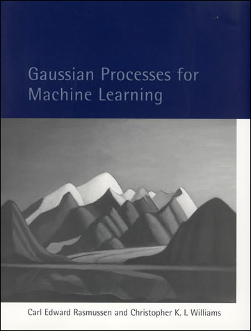
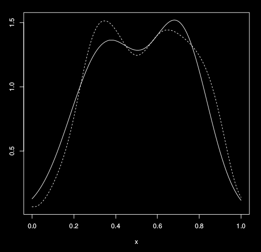
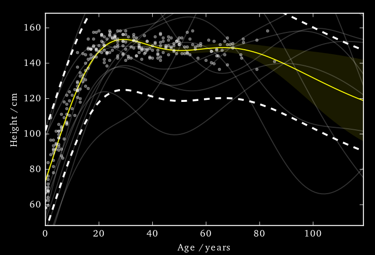
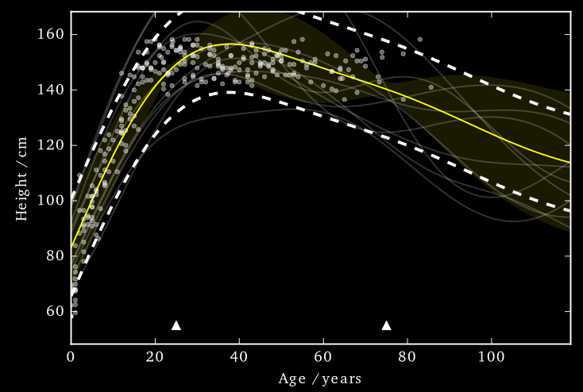

###  Cloaking Functions: Differential Privacy with Gaussian Processes  
### 2017-08-30
### Neil D. Lawrence
### Amazon and University of Sheffield
```@lawrennd``` [inverseprobability.com](http://inverseprobability.com)
[Paper on Arxiv](https://arxiv.org/pdf/1606.00720.pdf)
<!--  pandoc -s -S -c talks.css -t revealjs --mathjax="http://cdn.mathjax.org/mathjax/latest/MathJax.js?config=TeX-AMS-MML_HTMLorMML" -o 2017-08-30-cloaking-functions.slides.html 2017-08-30-cloaking-functions.md
-->


## "Embodiment Factors"

<table>
<tr><td></td><td align="center">

</td>
<td align="center">

</td>
</tr>
<tr>
<td>compute</td><td align="center">~10 gigaflops</td><td align="center">~ 1000 teraflops?</td>
</tr>
<tr>
<td>communicate</td><td align="center">~1 gigbit/s</td><td align="center">~ 100 bit/s</tr>
<td>embodiment<br>(compute/communicate)</td><td align="center">10</td><td align="center">~ 10<sup>13</sup></tr>
</table>


## Evolved Relationship {.slide: data-transition="none"}

<object type="image/svg+xml" data="./diagrams/data-science-information-flow_neg001.svg">
</object>

## Evolved Relationship {.slide: data-transition="none"}

<object type="image/svg+xml" data="./diagrams/data-science-information-flow_neg002.svg">
</object>

## Evolved Relationship {.slide: data-transition="none"}

<object type="image/svg+xml" data="./diagrams/data-science-information-flow_neg003.svg">
</object>


## Conversation {.slide: data-transition="none"}

<object type="image/svg+xml" data="./diagrams/anne_bob001.svg">
</object>

## Conversation {.slide: data-transition="none"}

<object type="image/svg+xml" data="./diagrams/anne_bob002.svg">
</object>

## Conversation {.slide: data-transition="none"}

<object type="image/svg+xml" data="./diagrams/anne_bob003.svg">
</object>

## Modelling

<object type="image/svg+xml" data="./diagrams/anne.svg">
</object>

## Modelling

<object type="image/svg+xml" data="./diagrams/bob.svg">
</object>


## 

{height="40%" style="border:none"}

## {data-transition="none"}
<!--frame start-->
<object type="image/svg+xml" data="./diagrams/gp_prior_samples_few_neg.svg">
</object>
<!---->

<!--frame end-->

## {data-transition="none"}
<!--frame start-->
<object type="image/svg+xml" data="./diagrams/gp_prior_samples_neg.svg">
</object>
<!---->

<!--frame end-->

## {data-transition="none"}
<!--frame start-->
<object type="image/svg+xml" data="./diagrams/gp_prior_samples_data_neg.svg">
</object>
<!---->

<!--frame end-->
## {data-transition="none"}
<!--frame start-->
<object type="image/svg+xml" data="./diagrams/gp_rejection_samples_neg.svg">
</object>
<!---->

<!--frame end-->

## Key Object {data-transition="none"}

* Covariance function, $\mathbf{K}$

* Determines properties of samples.

* Function of $\mathbf{X}$,
    $$k_{i,j} = k(\mathbf{x}_i, \mathbf{x}_j)$$

## Linear Algebra {data-transition="none"}

* Posterior mean

    $$f_D(\mathbf{x_*}) = \mathbf{k}(\mathbf{x}_*, \mathbf{X}) \mathbf{K}^{-1}
\mathbf{y}$$

* Posterior covariance
    $$\mathbf{C}_* = \mathbf{K}_{*,*} - \mathbf{K}_{*,\mathbf{f}}
\mathbf{K}^{-1} \mathbf{K}_{\mathbf{f}, *}$$

## Linear Algebra {data-transition="none"}

* Posterior mean

    $$f_D(\mathbf{x_*}) = \mathbf{k}(\mathbf{x}_*, \mathbf{X}) \boldsymbol{\alpha}$$

* Posterior covariance
    $$\mathbf{C}_* = \mathbf{K}_{*,*} - \mathbf{K}_{*,\mathbf{f}}
\mathbf{K}^{-1} \mathbf{K}_{\mathbf{f}, *}$$

## {data-transition="none"}
<!--frame start-->
<object type="image/svg+xml" data="./diagrams/gp_prior_samples_data_neg.svg">
</object>
<!---->

<!--frame end-->
## {data-transition="none"}
<!--frame start-->
<object type="image/svg+xml" data="./diagrams/gp_rejection_samples_neg.svg">
</object>
<!---->

<!--frame end-->

## {data-transition="none"}
<!--frame start-->
<object type="image/svg+xml" data="./diagrams/gp_prediction_neg.svg">
</object>
<!---->

<!--frame end-->

## Differential Privacy, summary {data-background="diagrams/pres_bg.png"}


* We want to protect a user from a linkage attack...

    ...while still performing inference over the whole group.

* Making a dataset private is more than just erasing names.

* To achieve a level of privacy one needs to add **randomness** to the
data.

* This is a fundamental feature of differential privacy.

See [The Algorithmic Foundations of Differential
Privacy](https://www.cis.upenn.edu/~aaroth/Papers/privacybook.pdf) by
Dwork and Roth for a rigorous introduction to the framework.


## Differential Privacy for Gaussian Processes {#differential-privacy-for-gaussian-processes }


## Differential Privacy for GPs {#differential-privacy-for-gps}

We have a dataset in which the inputs, $\mathbf{X}$, are **public**. The
outputs, $\mathbf{y}$, we want to keep **private**.

{width="65%" style="border:none" align="center"}

**Data consists of the heights and weights of 287 women from a census of
the !Kung**

## Vectors and Functions {#vectors-and-functions }

Hall et al. (2013) showed that one can ensure that a version of $f$,
function $\tilde{f}$ is $(\varepsilon, \delta)$-differentially
private by adding a scaled sample from a GP prior.

{width="30%" style="border:none" align="center"}

3 pages of maths ahead!

## Applied to Gaussian Processes {#applied-to-gaussian-processes
data-background="diagrams/pres_bg_bb.png"  }

* We applied this method to the GP posterior.

* The covariance of the posterior only depends on the inputs, $X$. So we
can compute this without applying DP.

* The mean function, $f_D(\mathbf{x_*})$, does depend on
$\mathbf{y}$.
    $$f_D(\mathbf{x_*}) = \mathbf{k}(x_*, \mathbf{X})
\mathbf{K}^{-1} \mathbf{y}$$

* We are interested in finding

    $$|| f_D(\mathbf{x_*}) -
f_{D^\prime}(\mathbf{x_*}) ||_H^2$$

    ...how much the mean function (in RKHS) can change due to a change in
$\mathbf{y}$.


## Applied to Gaussian Processes {#applied-to-gaussian-processes-1  }

* Using the representer theorem, we can write
    $$|| f_D(\mathbf{x_*}) -
	f_{D^\prime}(\mathbf{x_*}) ||_H^2$$
	
    as:

    $$\Big|\Big|\sum_{i=1}^n k(\mathbf{x_*},\mathbf{x}_i)
\left(\alpha_i - \alpha^\prime_i\right)\Big|\Big|_H^2$$

     where $\boldsymbol{\alpha} - \boldsymbol{\alpha}^\prime = \mathbf{K}^{-1}
\left(\mathbf{y} - \mathbf{y}^\prime \right)$


## {data-background="diagrams/pres_bg_bb.png" }

* L2 Norm

    $$\Big|\Big|\sum_{i=1}^n k(\mathbf{x_*},\mathbf{x}_i)
\left(\alpha_i - \alpha^\prime_i\right)\Big|\Big|_H^2$$

    where $\boldsymbol{\alpha} - \boldsymbol{\alpha}^\prime = \mathbf{K}^{-1}
\left(\mathbf{y} - \mathbf{y}^\prime \right)$

* We constrain the kernel: $-1\leq k(\cdot,\cdot) \leq 1$ and we only allow one
element of $\mathbf{y}$ and $\mathbf{y}'$ to differ (by at most
$d$).

* So only one column of $\mathbf{K}^{-1}$ will be involved in the change of mean
(which we are summing over).

* The distance above can then be shown to be no greater than
$d\;||\mathbf{K}^{-1}||_\infty$


## Applied to Gaussian Processes {#applied-to-gaussian-processes-2
    }

This 'works' in that it allows DP predictions...but to avoid too much
noise, the value of $\varepsilon$ is too large (here it is 100)

{width="50%" style="border:none" align="center"}

EQ kernel, $\ell = 25$ years, $\Delta=100$cm


## Inducing Inputs {#inducing-inputs}

Using sparse methods (i.e. inducing inputs) can help reduce the
sensitivity a little. We'll see more on this later.

{width="70%" style="border:none" align="center"}


## Cloaking {#cloaking}

* So far we've made the whole posterior mean function private...

    ...what if we just concentrate on making particular predictions private?


## Effect of perturbation {#effect-of-perturbation}

* Standard approach: sample the noise is from the GP's
**prior**.

* Not necessarily the most 'efficient' covariance to use.

## Cloaking {#cloaking-1 data-transition="None"}

<object type="image/svg+xml" data="./diagrams/dp_firstpoint0_neg.svg">
</object>

*Left*: Function change. *Right*: test point change

## Cloaking {#cloaking-1 data-transition="None"}

<object type="image/svg+xml" data="./diagrams/dp_firstpoint2_neg.svg">
</object>

*Left*: Function change. *Right*: test point change

## Cloaking {#cloaking-1 data-transition="None"}

<object type="image/svg+xml" data="./diagrams/dp_secondpoint0_neg.svg">
</object>

*Left*: Function change. *Right*: test point change

## Cloaking {#cloaking-1 data-transition="None"}

<object type="image/svg+xml" data="./diagrams/dp_secondpoint2_neg.svg">
</object>

*Left*: Function change. *Right*: test point change

## Cloaking {#cloaking-1 data-transition="None"}

<object type="image/svg+xml" data="./diagrams/dp_with_ellipse1_neg.svg">
</object>

*Left*: Function change. *Right*: test point change

## Cloaking {#cloaking-1 data-transition="None"}

<object type="image/svg+xml" data="./diagrams/dp_with_ellipse2_neg.svg">
</object>

*Left*: Function change. *Right*: test point change

## DP Vectors {#dp-vectors}

* Hall et al. (2013) also presented a bound on vectors.

* Find a bound ($\Delta$) on the scale of the output change, in term of
its Mahalanobis distance (wrt the added noise covariance).

    $$\sup_{D \sim {D'}} ||\mathbf{M}^{-1/2} (\mathbf{y}_* - \mathbf{y}_{*}')||_2 \leq \Delta$$

* We use this to scale the noise we add:

    $$\frac{\text{c}(\delta)\Delta}{\varepsilon} \mathcal{N}_d(0,\mathbf{M})$$

    We get to pick $\mathbf{M}$


## Cloaking {#cloaking-2}

* Intuitively we want to construct $\mathbf{M}$ so that it has greatest
covariance in those directions most affected by changes in training
points, so that it will be most able to mask those changes.

* The change in posterior mean predictions is,

     $$\mathbf{y}_* - \mathbf{y}'_* = \mathbf{K}_{*f} \mathbf{K}^{-1} (\mathbf{y}-\mathbf{y}')$$

* Effect of perturbing each training point on each test point is
represented in the cloaking matrix,

    $$\mathbf{C} = \mathbf{K}_{*f} \mathbf{K}^{-1}$$


## Cloaking {#cloaking-3}

* We assume we are protecting only one training input's change, by at most
$d$.

* So $\mathbf{y}-\mathbf{y}'$ will be all zeros except for one
element, $i$.\

* So the change in test points will be (at most)

    $$\mathbf{y}_*' - \mathbf{y}_* = d \mathbf{C}_{:i}$$

* We're able to write the earlier bound as,

    $$d^2 \sup_{i} \mathbf{c}_i^\top \mathbf{M}^{-1} \mathbf{c}_i \leq\Delta$$

    where $\mathbf{c}_i \triangleq \mathbf{C}_{:i}$


## Cloaking {#cloaking-4}

* Dealing with $d$ elsewhere and setting $\Delta = 1$ (thus $0 \leq
\mathbf{c}_i^\top \mathbf{M}^{-1} \mathbf{c}_i \leq 1$) and minimise
$\log |\mathbf{M}|$ (minimises the partial entropy).

* Using Lagrange multipliers and gradient descent, we find

    $$\mathbf{M} = \sum_i{\lambda_i \mathbf{c}_i \mathbf{c}_i^\top}$$

## Cloaking: Results {#cloaking-results}

The noise added by this method is now practical.

{width="100%" style="border:none" align="center"}

EQ kernel, $l = 25$ years, $\Delta=100$cm, $\varepsilon=1$

## Cloaking: Results {#cloaking-results-1}

It also has some interesting features;

-   Less noise where data is concentrated
-   Least noise far from any data
-   Most noise just outside data

{width="100%" style="border:none" align="center"}


## {data-background="diagrams/pres_bg_bb.png" }

House prices around London

{width="50%" style="border:none" align="center"}

## Citibike {#citibike}

Tested on 4d citibike dataset (predicting journey durations from
start/finish station locations).

The method appears to achieve lower noise than binning alternatives (for
reasonable $\varepsilon$).

{width="80%" style="border:none" align="center"} lengthscale in degrees, values
above, journey duration (in seconds)

## Cloaking and Inducing Inputs {#cloaking-and-inducing-inputs}

* Outliers poorly predicted.

* Too much noise around data 'edges'.

* Use inducing inputs to reduce the sensitivity to these outliers.

## Cloaking (no) Inducing Inputs {#cloaking-no-inducing-inputs  data-transition="None"}

{width="100%" style="border:none" align="center"}

## Cloaking and Inducing Inputs {#cloaking-and-inducing-inputs-1
   data-transition="None"}

{width="80%" style="border:none" align="center"}

## Results {#results}

* For 1D !Kung, RMSE improved from $15.0 \pm 2.0 \text{cm}$ to $11.1 \pm 0.8 \text{cm}$

    Use Age and Weight to predict Height

* For 2D !Kung, RMSE improved from $22.8 \pm 1.9 \text{cm}$ to $8.8 \pm 0.6 \text{cm}$

    Note that the uncertainty across cross-validation runs smaller. 2D version benefits from data's 1D manifold.

## Cloaking (no) Inducing Inputs {#cloaking-no-inducing-inputs-1 data-transition="none"}

{width="80%" style="border:none" align="center"}

## Cloaking and Inducing Inputs {#cloaking-and-inducing-inputs-2 data-transition="none"}

{width="80%" style="border:none" align="center"}

* **Summary** We have developed an improved method for performing
differentially private regression.

* **Future work** Multiple outputs, GP classification, DP Optimising
hyperparameters, Making the inputs private.

* **Thanks** Funders: EPSRC; Colleagues: **Michael T. Smith**, Mauricio, Max.

* **Recruiting** Deep Probabilistic Models: 2 year postdoc ([tinyurl.com/shefpostdoc](http://tinyurl.com/shefpostdoc))


## {data-background="diagrams/pres_bg.png"}

* [**The go-to book on differential privacy, by Dwork and Roth;**\
]{style="margin-left:-50px;"} Dwork, Cynthia, and Aaron Roth. "The
algorithmic foundations of differential privacy." Theoretical Computer
Science 9.3-4 (2013): 211-407.
[link](https://www.cis.upenn.edu/~aaroth/Papers/privacybook.pdf)

* [**Original basis of applying DP to GPs;**\
]{style="margin-left:-50px;"} Hall, Rob, Alessandro Rinaldo, and Larry
Wasserman. "Differential privacy for functions and functional data." The
Journal of Machine Learning Research 14.1 (2013): 703-727.
[link](http://www.stat.cmu.edu/~arinaldo/papers/hall13a.pdf)
## {data-background="diagrams/pres_bg.png"}


* [**Articles about the Massachusetts privacy debate**\
]{style="margin-left:-50px;"} Barth-Jones, Daniel C.
"The 're-identification' of Governor William Weld's medical information: a
critical re-examination of health data identification risks and privacy
protections, then and now." Then and Now (June 4, 2012) (2012).
[link](http://papers.ssrn.com/sol3/papers.cfm?abstract_id=2076397)


* Ohm, Paul. "Broken promises of privacy: Responding to the surprising
failure of anonymization." UCLA Law Review 57 (2010): 1701.
[link](https://epic.org/privacy/reidentification/ohm_article.pdf)

* Narayanan, Arvind, and Edward W. Felten. "No silver bullet:
De-identification still doesn’t work." White Paper (2014).
[link](http://randomwalker.info/publications/no-silver-bullet-de-identification.pdf)

## {data-background="diagrams/pres_bg.png"}


* Howell, N. Data from a partial census of the !kung san, dobe. 1967-1969.
https://public.tableau. com/profile/john.marriott\#!/vizhome/
kung-san/Attributes, 1967.

* **Images used:** BostonGlobe: [Mass
Mutual](https://c.o0bg.com/rf/image_960w/Boston/2011-2020/2015/05/29/BostonGlobe.com/Business/Images/MassMutual_04.jpg),
[Weld](https://c.o0bg.com/rf/image_960w/Boston/2011-2020/2014/10/20/BostonGlobe.com/Metro/Images/Gov.%20Bill%20Weld%201-100425.jpg).
Harvard: [Sweeney](http://www.gov.harvard.edu/files/Sweeney6crop.jpg).
Rich on flickr: [Sheffield
skyline](https://www.flickr.com/photos/rich_b1982/13114665103/in/pool-sheffieldskyline/).


